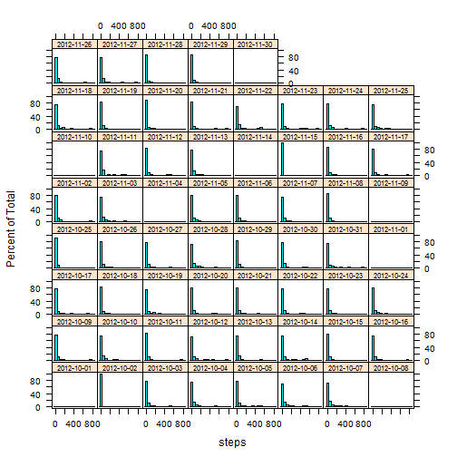
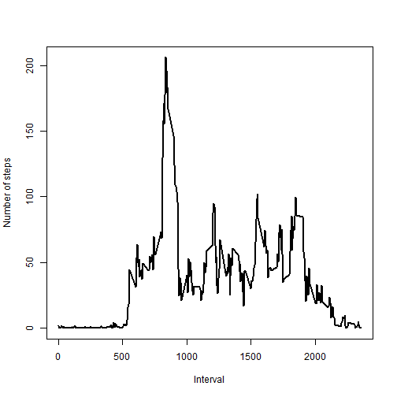
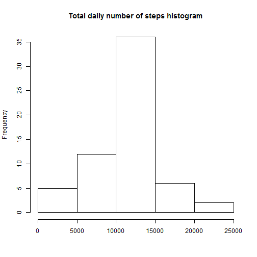
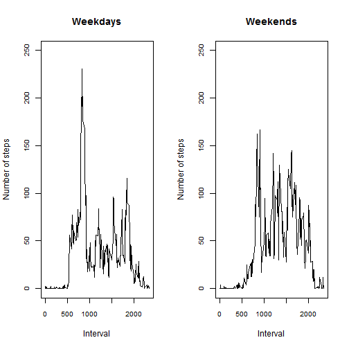

# Reproducible Research: Peer Assessment 1

This is a complete report for the project.
All displayed code is written assuming that a project dir is a working dir.

## Loading and preprocessing the data

First we read an unzipped dataset choosing appropriate formats for variables.

```r
data <- read.csv(unzip("activity.zip"), colClasses = c("numeric", "Date", "factor"))
```


## What is mean total number of steps taken per day?

This chunk of code plots histograms of steps taken each day using lattice package.

```r
library(lattice)
histogram(~steps | as.factor(date), data, par.strip.text = list(cex = 0.7))
```

 


And this piece computes and returns a table with daily mean and median values.

```r
steps.mm <- as.data.frame(sapply(split(data$steps, as.factor(data$date)), mean, 
    na.rm = T))
names(steps.mm) <- "Mean"
steps.mm$Median <- sapply(split(data$steps, as.factor(data$date)), median, na.rm = T)
print(steps.mm)
```

```
##               Mean Median
## 2012-10-01     NaN     NA
## 2012-10-02  0.4375      0
## 2012-10-03 39.4167      0
## 2012-10-04 42.0694      0
## 2012-10-05 46.1597      0
## 2012-10-06 53.5417      0
## 2012-10-07 38.2465      0
## 2012-10-08     NaN     NA
## 2012-10-09 44.4826      0
## 2012-10-10 34.3750      0
## 2012-10-11 35.7778      0
## 2012-10-12 60.3542      0
## 2012-10-13 43.1458      0
## 2012-10-14 52.4236      0
## 2012-10-15 35.2049      0
## 2012-10-16 52.3750      0
## 2012-10-17 46.7083      0
## 2012-10-18 34.9167      0
## 2012-10-19 41.0729      0
## 2012-10-20 36.0938      0
## 2012-10-21 30.6285      0
## 2012-10-22 46.7361      0
## 2012-10-23 30.9653      0
## 2012-10-24 29.0104      0
## 2012-10-25  8.6528      0
## 2012-10-26 23.5347      0
## 2012-10-27 35.1354      0
## 2012-10-28 39.7847      0
## 2012-10-29 17.4236      0
## 2012-10-30 34.0938      0
## 2012-10-31 53.5208      0
## 2012-11-01     NaN     NA
## 2012-11-02 36.8056      0
## 2012-11-03 36.7049      0
## 2012-11-04     NaN     NA
## 2012-11-05 36.2465      0
## 2012-11-06 28.9375      0
## 2012-11-07 44.7326      0
## 2012-11-08 11.1771      0
## 2012-11-09     NaN     NA
## 2012-11-10     NaN     NA
## 2012-11-11 43.7778      0
## 2012-11-12 37.3785      0
## 2012-11-13 25.4722      0
## 2012-11-14     NaN     NA
## 2012-11-15  0.1424      0
## 2012-11-16 18.8924      0
## 2012-11-17 49.7882      0
## 2012-11-18 52.4653      0
## 2012-11-19 30.6979      0
## 2012-11-20 15.5278      0
## 2012-11-21 44.3993      0
## 2012-11-22 70.9271      0
## 2012-11-23 73.5903      0
## 2012-11-24 50.2708      0
## 2012-11-25 41.0903      0
## 2012-11-26 38.7569      0
## 2012-11-27 47.3819      0
## 2012-11-28 35.3576      0
## 2012-11-29 24.4688      0
## 2012-11-30     NaN     NA
```


## What is the average daily activity pattern?

First we compile a data frame with average number of steps per interval.

```r
steps.int <- as.data.frame(sapply(split(data$steps, data$interval), mean, na.rm = T))
steps.int$interval <- as.numeric(rownames(steps.int))
names(steps.int) <- c("steps", "interval")
steps.int <- steps.int[order(steps.int$interval), ]
```


Using the data frame constructed above one can build a graph with average number of steps taken in each interval.

```r
plot(x = steps.int$interval, y = steps.int$steps, type = "l", xlab = "Interval", 
    ylab = "Number of steps", lwd = 2)
```

 


The following chunck computes and properly formats a 5-min interval with a max average number of steps.

```r
m <- as.character(steps.int[(order(steps.int$steps, decreasing = T)), ][1, 2])
max <- paste0(substr(m, 1, 1), ":", substr(m, 2, 3))
```


The 5-min interval with a maximum average number of steps is an interval starting at 8:35.

## Imputing missing values

This piece calculates the total number of missing entries.

```r
tot.na <- sum(is.na(data$steps))
```


There're total 2304 NAs in the data set.

The following chunk replaces NAs in the original dataset with average values per corresponding time interval using the 'plyr' package. New 'clean' dataset is saved.

```r
library(plyr)
data.nonas <- join(data, steps.int, "interval")
for (i in seq_along(data$steps)) {
    if (is.na(data.nonas[i, 1]) == TRUE) {
        data.nonas[i, 1] <- data.nonas[i, 4]
    }
}
data.nonas <- data.nonas[, 1:3]
```


Using a 'clean' dataset created above we calculate daily sums of steps taken.

```r
steps.sum.nonas <- as.data.frame(sapply(split(data.nonas$steps, as.factor(data.nonas$date)), 
    sum, na.rm = T))
names(steps.sum.nonas) <- "Sum"
```


Here's a histogram of a total number of daily steps.

```r
hist(steps.sum.nonas$Sum, xlab = "", main = "Total daily number of steps histogram")
```

 


Mean total daily steps taken (rounded) are 10766, median is 10766. Both values are higher compared to ones computed ignoring NAs in the dataset. This is due to chosen NAs replacement strategy (average values per corresponding interval).

## Are there differences in activity patterns between weekdays and weekends?

Let's first create a new factor variable with 'weekday' and 'weekend' levels.

```r
data.nonas$weekday <- weekdays(data.nonas$date)
for (i in seq_along(data.nonas$weekday)) {
    if (data.nonas$weekday[i] == "Saturday") {
        data.nonas$weekday[i] <- "weekend"
    } else if (data.nonas$weekday[i] == "Sunday") {
        data.nonas$weekday[i] <- "weekend"
    } else {
        data.nonas$weekday[i] <- "weekday"
    }
}
data.nonas$weekday <- as.factor(data.nonas$weekday)
```


Now we create a new data frame with average number of steps per interval splitting out weekdays and weekends.

```r
l <- split(data.nonas, data.nonas$weekday)
steps.int.nonas <- as.data.frame(sapply(l, function(x) {
    sapply(split(x, x[, 3]), function(y) {
        mean(y[, 1])
    })
}))
steps.int.nonas$interval <- as.numeric(rownames(steps.int.nonas))
steps.int.nonas <- steps.int.nonas[order(steps.int.nonas$interval), ]
```


Finally we plot average number of steps per time interval for weekdays and weekends.

```r
par(mfrow = c(1, 2))
plot(x = steps.int.nonas$interval, y = steps.int.nonas$weekday, type = "l", 
    xlab = "Interval", ylab = "Number of steps", main = "Weekdays", ylim = c(0, 
        250), cex.axis = 0.8)
plot(x = steps.int.nonas$interval, y = steps.int.nonas$weekend, type = "l", 
    xlab = "Interval", ylab = "Number of steps", main = "Weekends", ylim = c(0, 
        250), cex.axis = 0.8)
```

 

